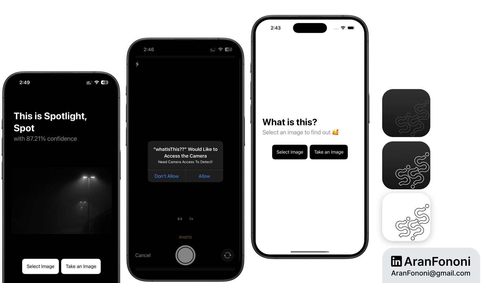

# AI Image Recognition App

### Project for Section 23: **Custom AI-Powered Image Classifier**  
This project builds on Section 23 of the **Complete iOS Development Bootcamp** by Angela Yu. Inspired by the "What's That Food" app, I took this concept further as a personal challenge, creating an AI-powered image recognition app using Core ML with a SwiftUI interface.

## Project Overview
The **AI Image Recognition App** uses **Core ML** and **Vision** to classify images selected by the user, returning the identified object along with a confidence score. The app leverages SwiftUI's declarative syntax and integrates a custom `ImagePicker` for capturing or selecting images.

## What I Learned
In developing this app, I focused on:
- **Core ML and Vision Frameworks**: Implemented Core ML and Vision requests for image classification, utilizing pre-trained models.
- **SwiftUI Integration**: Built a SwiftUI-based interface for a modern, declarative approach to UI design.
- **Handling Image Inputs**: Created a custom `ImagePicker` using `UIViewControllerRepresentable` to seamlessly manage image selection within a SwiftUI context.

## Key Skills
- Core ML model integration and Vision request handling
- SwiftUI components and layout for an intuitive user interface
- UIKit and SwiftUI interoperability through `UIViewControllerRepresentable`

## Additional Features
- Provides real-time feedback on object identification with high-confidence results.
- Offers dual options for users to select an image from the photo library or capture a new one using the camera.
- Designed to handle edge cases where the image is unrecognizable.

---

### Project Preview

---

### Footer

---

## Contact
For more information, feel free to reach out:  
- **Email**: [aranfononi@gmail.com](mailto:aranfononi@gmail.com)  
- **LinkedIn**: [Aran Fononi](https://www.linkedin.com/in/aran-fononi-18182b265)
